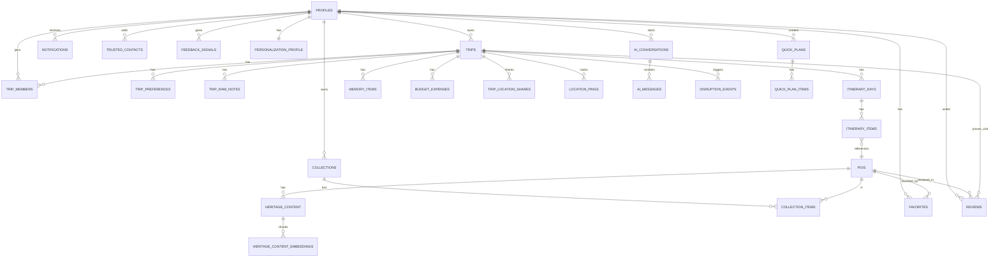

# Database Schema
## Supabase PostgreSQL + pgvector — AI Personalized Tourist Guide (TC-SO1)

Companion to `IMPLEMENTATION_BLUEPRINT.md`. Table names here are the single source of truth referenced by `API_SPECIFICATION.md` and `AI_ARCHITECTURE.md`.

**Status: implemented and applied to a real Supabase project (Phase 2, Database & Data Layer; extended in Phase 3, Authentication).** The executable source of truth is now `supabase/migrations/*.sql`, not the SQL reproduced in this document — this document is kept in sync with those migrations, but if the two ever disagree, the migrations are authoritative (they're what's actually running). Verified live via `backend/tests/test_live_database.py` (26 tests, schema/RLS/extensions/indexes/storage/vector/geospatial) and `backend/tests/test_rls_security.py` (12 tests, real cross-user Row Level Security checks against ephemeral Supabase Auth users — including Phase 3's `profiles` isolation tests).

---

## 0. Phase 2 Implementation Changelog

Every deviation from this document's originally-drafted SQL, found and fixed during real implementation (not merely planned) — each is a real migration in `supabase/migrations/`, applied to and verified against a live database, per `docs/PHASE_STATUS.md`'s Phase 2 section for full detail.

**Fixes carried over from `docs/ARCHITECTURE_REVIEW.md`** (planned there, actually implemented here):

| ID | Fix | Migration |
|---|---|---|
| C1 | Added `profiles.pace` column (FR-003 required input, previously missing entirely) | `20260825120002` |
| C2 | `audit_logs.actor_user_id` → `on delete set null` (was unspecified; blocked the account-deletion workflow) | `20260825120010` |
| M2 | Explicit `ON DELETE` behavior added to 6 previously-unspecified FKs (`itinerary_items.poi_id`→SET NULL, `quick_plan_items.poi_id`→CASCADE, `reviews.trip_id`→CASCADE, `sos_events.trip_id`→CASCADE, `profile_interests.interest_id`→CASCADE, `reviews.moderated_by`→SET NULL) | `20260825120004`, `20260825120005`, `20260825120007`, `20260825120009` |
| M8 | `ai_messages.conversation_id` made nullable + new `context_type` discriminator (`chat`\|`photo_qa`), resolving a genuine conflict between this document (NOT NULL) and `AI_ARCHITECTURE.md` §6 (Visual Q&A is a non-conversational endpoint) | `20260825120008` |
| H6 | `memory_items`, `budget_expenses`, `trip_raw_notes` RLS split from one permissive `for all` policy into shared SELECT (any trip member) + author-or-trip-owner-only INSERT/UPDATE/DELETE — previously any group-trip member could delete another member's uploaded photos | `20260825120004`, `20260825120005`, `20260825120006` |
| — | `trip_raw_notes` gained a `created_by` column — the H6 fix requires per-author tracking, which this table didn't have at all | `20260825120004` |
| L9 | `heritage_content_embeddings` — removed the client-facing SELECT policy entirely (service-role-only now) | `20260825120003` |
| L11 | Added admin UPDATE/DELETE RLS policies for `pois` and `heritage_content` (previously INSERT-only) | `20260825120003` |
| H1 | Resolved in favor of trigger-based profile provisioning — `handle_new_user()` + `on_auth_user_created` trigger on `auth.users` is now real, not just documented intent | `20260825120002` |

**New defects found only by live testing** (neither in the original draft nor in `ARCHITECTURE_REVIEW.md` — static review could not have caught either):

| Finding | Fix | Migration |
|---|---|---|
| `interests` was created with **no RLS enabled at all** (a genuine oversight — every other table had it) | `alter table ... enable row level security` + a public-read policy, matching the `pois`/`phrasebook_entries` pattern | `20260825120014` |
| **RLS infinite recursion** between `trips` and `trip_members`: `trips_select_member`'s policy queried `trip_members` directly, whose own policy queried `trips` directly — Postgres detects this as unbounded recursion (`InvalidObjectDefinitionError`) and it broke **every** query against either table under a real (non-owner) role, not an edge case | `trips_select_member` rewritten to call `is_trip_member()` (a `SECURITY DEFINER` function, which Postgres exempts from RLS via table-owner privilege) instead of a raw subquery — the standard, documented pattern for this exact class of cross-table RLS cycle | `20260825120015` |

**New, additive (not fixes — genuinely new ground covered this phase, per this phase's own scope):**
- `supabase.storage.buckets`/`storage.objects` — the `memory-items` private bucket + 4 RLS policies (§7 below), mirroring the H6 fix's shared-read/author-write split at the storage layer too (not just the `memory_items` table) — see §17.
- `public.memory_items_due_for_reminder()` / `public.location_pings_due_for_purge()` — retention-contract functions, `service_role`-only execute grant (§18 below).
- `public._migrations_applied` — a bookkeeping table (filename, applied_at) tracking which migration files have run, since migrations are applied directly via `asyncpg` rather than through the Supabase CLI's own tracking (see §19, Migration Tooling Decision).

**Migration path decision:** migrations live in `supabase/migrations/` (matching `DEPLOYMENT_PLAN.md` §3.2, which already specified this path), not the `database/` folder Phase 1 reserved — `database/` remains available for non-migration database tooling (seed/verification scripts). This is stated explicitly per this phase's "identify the conflict, document the resolution" instruction.

### 0b. Phase 3 Implementation Changelog

**New defect found only by live testing** (Phase 3's own cross-user `profiles` RLS tests, added because no `/v1/auth/*` endpoint addresses another user's profile by id, so this table's RLS had never actually been exercised cross-user before):

| Finding | Fix | Migration |
|---|---|---|
| **RLS infinite recursion within `profiles` itself**: `profiles_select_own`'s admin-check branch queried `public.profiles` directly from inside its own `USING` clause — evaluating that subquery re-invokes the same policy on the same table, an unbounded cycle Postgres detects as `InvalidObjectDefinitionError`. This broke **every** `select` against `profiles` under a real `authenticated` role, not just the admin path — same failure class as the Phase 2 `trips`/`trip_members` recursion, this time self-referential within one table rather than across two. | Added `public.is_admin(uuid)`, a `SECURITY DEFINER` helper (exempt from RLS via function-owner privilege, identical pattern to `is_trip_member()`); `profiles_select_own` rewritten to call it instead of the raw subquery | `20260825120016` |

### 0c. Phase 5 (F6 Maps & Navigation) Implementation Changelog

| Change | Detail | Migration |
|---|---|---|
| `pois.external_ref` — added `unique` constraint | Needed for `ON CONFLICT (external_ref) DO UPDATE` in the backend's Google-Places-cache upsert (`app/repositories/pois_repository.py`) to be atomic/race-safe. Curated rows (`external_ref IS NULL`) are unaffected — Postgres `UNIQUE` permits any number of `NULL`s. | `20260825120017` |
| `pois` — seeded 8 real, curated Indian heritage POIs (Taj Mahal, Red Fort, India Gate, Gateway of India, Mysore Palace, Golden Temple, Hawa Mahal, Meenakshi Amman Temple) | Reference/seed data (genuine coordinates and addresses, `source='curated'`), same category of seed as `interests` (Phase 2) — lets F6's search/nearby/detail endpoints return real data with no Google Maps API key configured. `is_heritage_flagship` deliberately left at its default (`false`): curating the launch flagship narration set is F8's decision, not F6's. | `20260825120017` |

---

## 1. Extensions

```sql
create extension if not exists "uuid-ossp";
create extension if not exists pgcrypto;      -- gen_random_uuid()
create extension if not exists vector;        -- pgvector — embeddings (heritage RAG, personalization)
create extension if not exists postgis;       -- geography type — POI location, geofencing, nearby search
```

PostGIS is added beyond the PRD's literal "PostgreSQL + pgvector" wording as the standard, low-risk way to satisfy FR-006's arrival-radius detection and F6's "nearby" queries efficiently (`ST_DWithin` with a GiST index) rather than hand-rolling haversine math in the application layer. It is infrastructure serving an already-specified requirement, not a new feature. Supabase supports enabling it with one line.

---

## 2. Two-Layer Authorization Model

1. **Primary layer — FastAPI:** almost all writes and most reads go through the FastAPI backend, which validates the Supabase JWT, applies business-rule checks (§16 of the PRD), and then reads/writes Postgres using the **Supabase service-role key** (RLS bypassed intentionally, because the backend has already done the authorization check in application code).
2. **Defense-in-depth layer — Postgres RLS:** every table still has RLS **enabled** with policies scoped to `auth.uid()`. This bounds the blast radius if the client-side anon key is ever used directly (e.g. Supabase Realtime subscriptions for live notifications, or direct Storage access for memory-box photos) and protects against a bug in the FastAPI authorization layer becoming a full data breach.

Every table below is created with `alter table ... enable row level security;`. Policy SQL is given per table where non-trivial.

---

## 3. Identity & Profile

### `profiles`
Extends `auth.users` (managed entirely by Supabase Auth — Google OAuth2 only, no password column anywhere, per §27). Row is provisioned by an `on_auth_user_created` trigger, never directly by client — enforces FR-002's "no partial account on denied consent."

```sql
create table public.profiles (
  id                 uuid primary key references auth.users(id) on delete cascade,
  display_name       text,
  avatar_url         text,
  home_region        text,               -- seeds default local-language phrasebook (FR-009)
  travel_style       text,               -- e.g. 'relaxed' | 'packed' | 'balanced' (onboarding, FR-003)
  pace               text check (pace in ('relaxed','balanced','packed')),  -- FR-003 input; fixes C1
  budget_bracket     text,               -- e.g. 'budget' | 'mid' | 'premium'
  role               text not null default 'traveller' check (role in ('traveller','admin')),
  onboarding_completed_at timestamptz,
  created_at         timestamptz not null default now(),
  updated_at         timestamptz not null default now()
);
alter table public.profiles enable row level security;

-- Uses is_admin() (SECURITY DEFINER, defined below), NOT a raw subquery
-- against public.profiles — the raw form caused real infinite RLS
-- recursion (fixed in migration 20260825120016; see the Phase 3
-- Implementation Changelog at the top of this document, §0b).
create function public.is_admin(check_user_id uuid)
returns boolean language sql stable security definer set search_path = public as $$
  select exists (select 1 from public.profiles where id = check_user_id and role = 'admin');
$$;

create policy "profiles_select_own" on public.profiles
  for select using (auth.uid() = id or public.is_admin(auth.uid()));
create policy "profiles_update_own" on public.profiles
  for update using (auth.uid() = id);

-- H1 resolution: the trigger is real, not just documented intent.
create function public.handle_new_user()
returns trigger language plpgsql security definer set search_path = public as $$
begin
  insert into public.profiles (id) values (new.id) on conflict (id) do nothing;
  return new;
end;
$$;
create trigger on_auth_user_created
  after insert on auth.users
  for each row execute function public.handle_new_user();
```

### `interests` / `profile_interests`
Lookup table of interest tags (curated) + user selections from onboarding (FR-003, BR-019).

```sql
create table public.interests (
  id     smallint primary key generated always as identity,
  slug   text unique not null,           -- 'heritage', 'food', 'nightlife', 'nature', ...
  label  text not null
);
-- Found missing entirely by live testing (no RLS at all — a genuine
-- oversight, not present in the original draft or ARCHITECTURE_REVIEW.md):
alter table public.interests enable row level security;
create policy "interests_read_all" on public.interests
  for select using (auth.role() = 'authenticated');

create table public.profile_interests (
  profile_id  uuid not null references public.profiles(id) on delete cascade,
  interest_id smallint not null references public.interests(id) on delete cascade,  -- fixes M2
  weight      numeric not null default 1.0,   -- adjusted over time by the Personalization Engine
  source      text not null default 'onboarding' check (source in ('onboarding','inferred','explicit_feedback')),
  updated_at  timestamptz not null default now(),
  primary key (profile_id, interest_id)
);
alter table public.profile_interests enable row level security;
create policy "profile_interests_own" on public.profile_interests
  for all using (auth.uid() = profile_id);
```

---

## 4. Trips & Itinerary

### `trips`

```sql
create table public.trips (
  id               uuid primary key default gen_random_uuid(),
  owner_id         uuid not null references public.profiles(id) on delete cascade,
  title            text not null,
  destination      text not null,
  destination_lat  double precision,
  destination_lng  double precision,
  start_date       date,
  end_date         date,
  status           text not null default 'draft'
                     check (status in ('draft','upcoming','active','completed','cancelled')),
  trip_type        text not null default 'solo' check (trip_type in ('solo','group','quick_plan')),
  budget_planned   numeric(12,2),
  budget_currency  text not null default 'INR',
  generation_status text not null default 'none'
                     check (generation_status in ('none','pending','succeeded','fallback_used','failed')),
  deleted_at       timestamptz,                 -- soft-delete (§28 "user cancels a trip")
  created_at       timestamptz not null default now(),
  updated_at       timestamptz not null default now()
);
create index trips_owner_idx on public.trips(owner_id) where deleted_at is null;
create index trips_status_idx on public.trips(status);
alter table public.trips enable row level security;

-- Uses is_trip_member() (defined below in this section), NOT a raw subquery
-- into trip_members — a raw subquery here caused a real, live-tested bug:
-- trip_members' own SELECT policy queries trips directly, so trips querying
-- trip_members and trip_members querying trips forms an infinite RLS
-- recursion cycle that Postgres detects and rejects for EVERY query
-- against either table (InvalidObjectDefinitionError), not an edge case.
-- is_trip_member() is SECURITY DEFINER and owned by the table owner, which
-- Postgres exempts from RLS by default — its internal queries terminate
-- immediately instead of re-entering either policy. Found and fixed live;
-- see the Phase 2 Implementation Changelog at the top of this document.
create policy "trips_select_member" on public.trips
  for select using (
    auth.uid() = owner_id
    or public.is_trip_member(id)
  );
create policy "trips_write_owner" on public.trips
  for all using (auth.uid() = owner_id);
```

### `trip_members` (Phase 2 — F19 Group Planning)

```sql
create table public.trip_members (
  trip_id       uuid not null references public.trips(id) on delete cascade,
  user_id       uuid not null references public.profiles(id) on delete cascade,
  role          text not null default 'member' check (role in ('organiser','member')),
  invite_status text not null default 'invited' check (invite_status in ('invited','accepted','declined','no_response')),
  invited_at    timestamptz not null default now(),
  responded_at  timestamptz,
  primary key (trip_id, user_id)
);
alter table public.trip_members enable row level security;
create policy "trip_members_select" on public.trip_members
  for select using (
    auth.uid() = user_id
    or exists (select 1 from public.trips t where t.id = trip_id and t.owner_id = auth.uid())
  );
```

### `trip_preferences` (Phase 2 — per-member inputs for group reconciliation, FR-012)

```sql
create table public.trip_preferences (
  trip_id     uuid not null references public.trips(id) on delete cascade,
  user_id     uuid not null references public.profiles(id) on delete cascade,
  interests   jsonb not null default '[]',
  budget_max  numeric(12,2),
  constraints jsonb not null default '{}',   -- e.g. {"pace":"relaxed","must_include":["Red Fort"]}
  submitted_at timestamptz not null default now(),
  primary key (trip_id, user_id)
);
alter table public.trip_preferences enable row level security;
create policy "trip_preferences_own_or_organiser" on public.trip_preferences
  for select using (
    auth.uid() = user_id
    or exists (select 1 from public.trips t where t.id = trip_id and t.owner_id = auth.uid())
  );
```

### `trip_raw_notes` (FR-005 — user-provided trip ideas)

`created_by` was added to make the H6 fix below possible — the original draft had no author-tracking column at all, so a correct per-author RLS policy couldn't be written until this was added.

```sql
create table public.trip_raw_notes (
  id                  uuid primary key default gen_random_uuid(),
  trip_id             uuid not null references public.trips(id) on delete cascade,
  created_by          uuid references public.profiles(id) on delete set null,  -- added for the H6 fix
  raw_text            text not null,
  extracted_places    jsonb,             -- structured elements pulled out by the Idea Extraction step
  unparsed_remainder  text,              -- always preserved and shown back to the user (FR-005 business rule)
  parsed_at           timestamptz,
  created_at          timestamptz not null default now()
);
alter table public.trip_raw_notes enable row level security;

-- H6 fix: shared viewing for any trip member (as before), but mutation
-- restricted to the author or the trip owner — was previously one
-- permissive "for all" policy granting any member full CRUD, including
-- deleting another member's notes.
create policy "trip_raw_notes_select" on public.trip_raw_notes
  for select using (public.is_trip_member(trip_id));
create policy "trip_raw_notes_insert" on public.trip_raw_notes
  for insert with check (public.is_trip_member(trip_id) and (created_by = auth.uid() or created_by is null));
create policy "trip_raw_notes_update_delete_author_or_owner" on public.trip_raw_notes
  for update using (
    created_by = auth.uid()
    or exists (select 1 from public.trips t where t.id = trip_id and t.owner_id = auth.uid())
  );
create policy "trip_raw_notes_delete_author_or_owner" on public.trip_raw_notes
  for delete using (
    created_by = auth.uid()
    or exists (select 1 from public.trips t where t.id = trip_id and t.owner_id = auth.uid())
  );
```

### `itinerary_days` / `itinerary_items`

```sql
create table public.itinerary_days (
  id       uuid primary key default gen_random_uuid(),
  trip_id  uuid not null references public.trips(id) on delete cascade,
  day_number smallint not null,
  date       date,
  unique (trip_id, day_number)
);

create table public.itinerary_items (
  id                uuid primary key default gen_random_uuid(),
  trip_id           uuid not null references public.trips(id) on delete cascade,
  day_id            uuid not null references public.itinerary_days(id) on delete cascade,
  poi_id            uuid references public.pois(id) on delete set null,  -- fixes M2
  sequence_order    smallint not null,
  planned_start     time,
  planned_end       time,
  estimated_duration_min smallint,
  estimated_cost    numeric(10,2),
  status            text not null default 'planned'
                       check (status in ('planned','confirmed','skipped','completed')),
  source            text not null default 'ai' check (source in ('ai','user','imported')),
  verify_on_arrival boolean not null default false,   -- opening hours unknown (§16 business rule)
  notes             text,
  created_at        timestamptz not null default now(),
  updated_at        timestamptz not null default now()
);
create index itinerary_items_trip_idx on public.itinerary_items(trip_id);
create index itinerary_items_day_idx on public.itinerary_items(day_id);
alter table public.itinerary_days enable row level security;
alter table public.itinerary_items enable row level security;
-- policies mirror trips_select_member via trip_id join (see §Policy Helper Function below)
```

To avoid repeating the same "am I a member of this trip" subquery in every child table's policy, a helper function is defined once:

```sql
create or replace function public.is_trip_member(p_trip_id uuid)
returns boolean language sql stable security definer as $$
  select exists (
    select 1 from public.trips t
    where t.id = p_trip_id
      and (t.owner_id = auth.uid()
        or exists (select 1 from public.trip_members m where m.trip_id = t.id and m.user_id = auth.uid()))
  );
$$;

create policy "itinerary_days_member" on public.itinerary_days for all using (public.is_trip_member(trip_id));
create policy "itinerary_items_member" on public.itinerary_items for all using (public.is_trip_member(trip_id));
```

*(This `is_trip_member()` helper is reused by every trip-scoped table below instead of re-stating the policy.)*

---

## 5. Points of Interest & Heritage Content (RAG)

### `pois`

```sql
create table public.pois (
  id                uuid primary key default gen_random_uuid(),
  name              text not null,
  category          text not null check (category in ('heritage','restaurant','attraction','nature','shopping','other')),
  location          geography(Point, 4326) not null,
  address           text,
  city              text,
  region            text,
  country           text not null default 'India',
  opening_hours     jsonb,              -- structured weekly hours; null => "verify on arrival"
  avg_cost          numeric(10,2),
  source            text not null default 'curated' check (source in ('curated','places_api')),
  external_ref      text,               -- Google Places place_id, if sourced externally
  is_heritage_flagship boolean not null default false,  -- true for the launch 5–10 curated POIs (§29.1)
  created_at        timestamptz not null default now(),
  updated_at        timestamptz not null default now()
);
create index pois_location_gix on public.pois using gist (location);
create index pois_category_idx on public.pois(category);
alter table public.pois enable row level security;
create policy "pois_read_all" on public.pois for select using (auth.role() = 'authenticated');
create policy "pois_write_admin" on public.pois for insert with check (
  exists (select 1 from public.profiles p where p.id = auth.uid() and p.role = 'admin')
);
-- fixes L11 (was INSERT-only):
create policy "pois_update_admin" on public.pois for update using (
  exists (select 1 from public.profiles p where p.id = auth.uid() and p.role = 'admin')
);
create policy "pois_delete_admin" on public.pois for delete using (
  exists (select 1 from public.profiles p where p.id = auth.uid() and p.role = 'admin')
);
```

### `heritage_content`
Curated, versioned, verified reference content — the grounding source for the RAG pipeline (§19, §22). Never auto-published from unguided model generation.

```sql
create table public.heritage_content (
  id               uuid primary key default gen_random_uuid(),
  poi_id           uuid not null references public.pois(id) on delete cascade,
  layer            text not null check (layer in ('overview','deep')),   -- layered storytelling, §22
  section_title    text not null,     -- e.g. 'Entrance', 'Main Dome', 'West Wing'
  body_text        text not null,
  source_citation  text not null,     -- vetted reference (tourism/heritage body, licensed content)
  language         text not null default 'en',
  version          integer not null default 1,
  verified_by      uuid references public.profiles(id),
  verified_at      timestamptz,
  is_published     boolean not null default false,
  created_at       timestamptz not null default now(),
  updated_at       timestamptz not null default now()
);
create index heritage_content_poi_idx on public.heritage_content(poi_id) where is_published;
alter table public.heritage_content enable row level security;
create policy "heritage_content_read_published" on public.heritage_content
  for select using (is_published and auth.role() = 'authenticated');
create policy "heritage_content_write_admin" on public.heritage_content for insert with check (
  exists (select 1 from public.profiles p where p.id = auth.uid() and p.role = 'admin')
);
-- fixes L11 (was INSERT-only):
create policy "heritage_content_update_admin" on public.heritage_content for update using (
  exists (select 1 from public.profiles p where p.id = auth.uid() and p.role = 'admin')
);
create policy "heritage_content_delete_admin" on public.heritage_content for delete using (
  exists (select 1 from public.profiles p where p.id = auth.uid() and p.role = 'admin')
);
```

### `heritage_content_embeddings`
Chunked vectors over `heritage_content.body_text` for pgvector similarity search — see `AI_ARCHITECTURE.md` §RAG Pipeline for the ingestion/chunking process.

```sql
create table public.heritage_content_embeddings (
  id                  uuid primary key default gen_random_uuid(),
  heritage_content_id uuid not null references public.heritage_content(id) on delete cascade,
  chunk_index         smallint not null,
  chunk_text          text not null,
  embedding           vector(1536) not null,   -- dimension depends on chosen embedding model; see AI_ARCHITECTURE.md §Embedding Model
  created_at          timestamptz not null default now()
);
create index heritage_embeddings_ivfflat on public.heritage_content_embeddings
  using ivfflat (embedding vector_cosine_ops) with (lists = 100);
alter table public.heritage_content_embeddings enable row level security;
-- fixes L9: NO client-facing policy at all (was previously readable by any
-- authenticated user — bypassed the narration API's layer/section gating
-- and confidence-flagging entirely). Default-deny for anon/authenticated;
-- only the service-role key reads this table, via the backend's RAG
-- retrieval step.
```

`lists = 100` is a reasonable starting value for a low-thousands-of-rows corpus (5–10 flagship POIs at launch); revisit per pgvector's tuning guidance once the catalog scales (F24).

### `phrasebook_entries` (FR-009)

```sql
create table public.phrasebook_entries (
  id                uuid primary key default gen_random_uuid(),
  region             text not null,          -- maps to trips.destination / profiles.home_region
  language_code      text not null,          -- BCP-47, e.g. 'hi-IN', 'ta-IN'
  category           text not null,          -- 'directions','prices','essentials','courtesy'
  phrase_en          text not null,
  phrase_local_script text not null,
  phrase_transliteration text not null,
  audio_url          text,                   -- reserved for Phase 2 live-translation-adjacent audio
  created_at         timestamptz not null default now()
);
create index phrasebook_region_idx on public.phrasebook_entries(region, language_code);
alter table public.phrasebook_entries enable row level security;
create policy "phrasebook_read_all" on public.phrasebook_entries for select using (auth.role() = 'authenticated');
```

---

## 6. Memory Box, Collections, Reviews

### `memory_items` (FR-010)

```sql
create table public.memory_items (
  id                 uuid primary key default gen_random_uuid(),
  trip_id            uuid not null references public.trips(id) on delete cascade,
  user_id            uuid not null references public.profiles(id) on delete cascade,
  item_type          text not null check (item_type in ('photo','video','note')),
  storage_path       text,               -- Supabase Storage object path (encrypted-at-rest bucket)
  caption            text,
  taken_at           timestamptz,
  uploaded_at        timestamptz not null default now(),
  retention_expires_at timestamptz not null default (now() + interval '12 months'),
  expiry_reminder_sent_at timestamptz,
  downloaded_at      timestamptz,
  deleted_at         timestamptz          -- explicit user deletion only; the retention job NEVER sets this (§43.3)
);
create index memory_items_trip_idx on public.memory_items(trip_id);
create index memory_items_expiry_idx on public.memory_items(retention_expires_at) where deleted_at is null;
alter table public.memory_items enable row level security;

-- fixes H6: split from one permissive "for all" policy (which let any
-- group-trip member delete another member's photos — a real defect, since
-- §43.3 promises memory-box items are never surprise-deleted) into shared
-- SELECT + author-or-trip-owner-only mutation.
create policy "memory_items_select_member" on public.memory_items
  for select using (public.is_trip_member(trip_id));
create policy "memory_items_insert_own" on public.memory_items
  for insert with check (public.is_trip_member(trip_id) and user_id = auth.uid());
create policy "memory_items_update_author_or_owner" on public.memory_items
  for update using (
    user_id = auth.uid()
    or exists (select 1 from public.trips t where t.id = trip_id and t.owner_id = auth.uid())
  );
create policy "memory_items_delete_author_or_owner" on public.memory_items
  for delete using (
    user_id = auth.uid()
    or exists (select 1 from public.trips t where t.id = trip_id and t.owner_id = auth.uid())
  );
```

**Retention job contract (critical business rule, §43.3):** a scheduled job selects rows where `retention_expires_at - now() < interval '14 days'` and `expiry_reminder_sent_at is null`, sends a reminder notification with a one-tap download/extend action, and stamps `expiry_reminder_sent_at`. **No automated job ever sets `deleted_at`.** Deletion after expiry (if the user takes no action) is a deliberate product decision to be made with explicit legal/policy sign-off, not a default background behavior — see `DEPLOYMENT_PLAN.md` §Scheduled Jobs.

### `collections` / `collection_items` / `favorites` (FR-011)

```sql
create table public.collections (
  id         uuid primary key default gen_random_uuid(),
  user_id    uuid not null references public.profiles(id) on delete cascade,
  name       text not null,
  created_at timestamptz not null default now(),
  unique (user_id, name)
);

create table public.collection_items (
  collection_id uuid not null references public.collections(id) on delete cascade,
  poi_id        uuid not null references public.pois(id) on delete cascade,
  added_at      timestamptz not null default now(),
  primary key (collection_id, poi_id)
);

create table public.favorites (
  user_id    uuid not null references public.profiles(id) on delete cascade,
  poi_id     uuid not null references public.pois(id) on delete cascade,
  created_at timestamptz not null default now(),
  primary key (user_id, poi_id)
);
alter table public.collections enable row level security;
alter table public.collection_items enable row level security;
alter table public.favorites enable row level security;
create policy "collections_own" on public.collections for all using (auth.uid() = user_id);
create policy "collection_items_own" on public.collection_items for all using (
  exists (select 1 from public.collections c where c.id = collection_id and c.user_id = auth.uid())
);
create policy "favorites_own" on public.favorites for all using (auth.uid() = user_id);
```

### `reviews` (FR-013)

```sql
create table public.reviews (
  id            uuid primary key default gen_random_uuid(),
  user_id       uuid not null references public.profiles(id) on delete cascade,
  poi_id        uuid not null references public.pois(id) on delete cascade,
  trip_id       uuid not null references public.trips(id) on delete cascade,   -- fixes M2; proves a completed visit (FR-013 business rule)
  rating        smallint not null check (rating between 1 and 5),
  review_text   text,
  status        text not null default 'pending' check (status in ('pending','published','rejected')),
  moderated_by  uuid references public.profiles(id) on delete set null,  -- fixes M2
  moderated_at  timestamptz,
  created_at    timestamptz not null default now()
);
create index reviews_poi_idx on public.reviews(poi_id) where status = 'published';
alter table public.reviews enable row level security;
create policy "reviews_read_published" on public.reviews for select using (status = 'published' or user_id = auth.uid());
create policy "reviews_insert_own" on public.reviews for insert with check (
  auth.uid() = user_id
  and exists (select 1 from public.trips t where t.id = trip_id and t.owner_id = auth.uid() and t.status = 'completed')
);
```

The `reviews_insert_own` check enforces "only users who completed a trip including that place may review it" directly at the database layer, not only in application code — a deliberate second enforcement point for a trust-critical rule (§16).

---

## 7. Notifications & Devices

```sql
create table public.notifications (
  id          uuid primary key default gen_random_uuid(),
  user_id     uuid not null references public.profiles(id) on delete cascade,
  trip_id     uuid references public.trips(id) on delete cascade,
  type        text not null check (type in ('arrival','disruption','memory_expiry','sos','group_invite','reminder','system')),
  title       text not null,
  body        text not null,
  payload     jsonb not null default '{}',
  read_at     timestamptz,
  delivered_channels text[] not null default '{}',   -- e.g. {'push','in_app'}
  created_at  timestamptz not null default now()
);
create index notifications_user_idx on public.notifications(user_id, read_at);
alter table public.notifications enable row level security;
create policy "notifications_own" on public.notifications for all using (auth.uid() = user_id);

create table public.device_push_tokens (
  id          uuid primary key default gen_random_uuid(),
  user_id     uuid not null references public.profiles(id) on delete cascade,
  expo_push_token text not null unique,
  platform    text not null check (platform in ('ios','android')),
  created_at  timestamptz not null default now()
);
alter table public.device_push_tokens enable row level security;
create policy "device_push_tokens_own" on public.device_push_tokens for all using (auth.uid() = user_id);
```

---

## 8. Budget

```sql
create table public.budget_expenses (
  id          uuid primary key default gen_random_uuid(),
  trip_id     uuid not null references public.trips(id) on delete cascade,
  user_id     uuid not null references public.profiles(id) on delete cascade,
  category    text not null,        -- 'lodging','food','transport','activity','other'
  amount      numeric(10,2) not null check (amount >= 0),
  currency    text not null default 'INR',
  split_with  jsonb,                -- Phase 2: [{"user_id": "...", "share": 0.5}, ...]
  logged_at   timestamptz not null default now()
);
create index budget_expenses_trip_idx on public.budget_expenses(trip_id);
alter table public.budget_expenses enable row level security;

-- fixes H6: same shared-view/author-or-owner-mutation split as memory_items —
-- a group member can see the shared trip budget, but not silently edit or
-- delete another member's logged expense.
create policy "budget_expenses_select_member" on public.budget_expenses
  for select using (public.is_trip_member(trip_id));
create policy "budget_expenses_insert_own" on public.budget_expenses
  for insert with check (public.is_trip_member(trip_id) and user_id = auth.uid());
create policy "budget_expenses_update_author_or_owner" on public.budget_expenses
  for update using (
    user_id = auth.uid()
    or exists (select 1 from public.trips t where t.id = trip_id and t.owner_id = auth.uid())
  );
create policy "budget_expenses_delete_author_or_owner" on public.budget_expenses
  for delete using (
    user_id = auth.uid()
    or exists (select 1 from public.trips t where t.id = trip_id and t.owner_id = auth.uid())
  );
```

---

## 9. Safety & SOS (Phase 2 — FR-017, Recommended Enhancement)

```sql
create table public.trusted_contacts (
  id         uuid primary key default gen_random_uuid(),
  user_id    uuid not null references public.profiles(id) on delete cascade,
  name       text not null,
  phone      text,
  email      text,
  created_at timestamptz not null default now(),
  check (phone is not null or email is not null)
);
alter table public.trusted_contacts enable row level security;
create policy "trusted_contacts_own" on public.trusted_contacts for all using (auth.uid() = user_id);

create table public.trip_location_shares (
  id          uuid primary key default gen_random_uuid(),
  trip_id     uuid not null references public.trips(id) on delete cascade,
  user_id     uuid not null references public.profiles(id) on delete cascade,
  share_token text not null unique default encode(gen_random_bytes(24), 'hex'),
  is_active   boolean not null default true,
  started_at  timestamptz not null default now(),
  expires_at  timestamptz not null      -- auto-set to trip end date; enforced at share-creation time
);
alter table public.trip_location_shares enable row level security;
create policy "trip_location_shares_own" on public.trip_location_shares for all using (auth.uid() = user_id);
-- Note: the trusted contact viewing a share is typically NOT an app user (no auth.uid()).
-- That read path is served by a dedicated FastAPI endpoint validated against share_token + expiry,
-- using the service-role key — never a client-side anon-key RLS read. See API_SPECIFICATION.md §Safety.

create table public.sos_events (
  id              uuid primary key default gen_random_uuid(),
  user_id         uuid not null references public.profiles(id) on delete cascade,
  trip_id         uuid references public.trips(id) on delete cascade,  -- fixes M2
  triggered_at    timestamptz not null default now(),
  last_known_lat  double precision,
  last_known_lng  double precision,
  location_captured_at timestamptz,
  resolved_at     timestamptz
);
alter table public.sos_events enable row level security;
create policy "sos_events_own" on public.sos_events for all using (auth.uid() = user_id);
```

### `location_pings` (FR-006) — ephemeral, active-trip-only retention

```sql
create table public.location_pings (
  id          uuid primary key default gen_random_uuid(),
  trip_id     uuid not null references public.trips(id) on delete cascade,
  user_id     uuid not null references public.profiles(id) on delete cascade,
  location    geography(Point, 4326) not null,
  recorded_at timestamptz not null default now()
);
create index location_pings_trip_idx on public.location_pings(trip_id, recorded_at desc);
create index location_pings_gix on public.location_pings using gist (location);
alter table public.location_pings enable row level security;
create policy "location_pings_own" on public.location_pings for all using (auth.uid() = user_id);
```

**Retention rule (Section 23, "real-time location should not be retained indefinitely"):** a scheduled job hard-deletes `location_pings` rows where the parent trip's `status = 'completed'` (or `cancelled`) and `recorded_at < now() - interval '7 days'`. This is a genuine delete (not soft-delete) because raw location history is the single most privacy-sensitive dataset in the system (§27, §38 risk table). See `DEPLOYMENT_PLAN.md` §Scheduled Jobs.

---

## 10. Personalization & AI Conversation Logs

```sql
create table public.feedback_signals (
  id                 uuid primary key default gen_random_uuid(),
  user_id            uuid not null references public.profiles(id) on delete cascade,
  trip_id            uuid references public.trips(id) on delete cascade,
  itinerary_item_id  uuid references public.itinerary_items(id) on delete set null,
  signal_type        text not null check (signal_type in
                        ('accept','reject','thumbs_up','thumbs_down','explicit_correction','review_submitted')),
  value              jsonb not null default '{}',
  created_at         timestamptz not null default now()
);
create index feedback_signals_user_idx on public.feedback_signals(user_id, created_at desc);
alter table public.feedback_signals enable row level security;
create policy "feedback_signals_own" on public.feedback_signals for all using (auth.uid() = user_id);

create table public.personalization_profile (
  user_id           uuid primary key references public.profiles(id) on delete cascade,
  preference_weights jsonb not null default '{}',   -- derived interest-weight vector, recomputed periodically
  taste_embedding    vector(1536),                   -- optional embedding-space representation for similarity recs
  updated_at         timestamptz not null default now()
);
alter table public.personalization_profile enable row level security;
create policy "personalization_profile_own" on public.personalization_profile for select using (auth.uid() = user_id);
-- writes: service-role only (computed server-side by the Personalization Engine, never client-writable)
```

```sql
create table public.ai_conversations (
  id         uuid primary key default gen_random_uuid(),
  user_id    uuid not null references public.profiles(id) on delete cascade,
  trip_id    uuid references public.trips(id) on delete cascade,
  started_at timestamptz not null default now()
);

create table public.ai_messages (
  id              uuid primary key default gen_random_uuid(),
  -- fixes M8: nullable + context_type discriminator. AI_ARCHITECTURE.md §6's
  -- Visual Q&A is a single-shot endpoint, not part of an ai_conversations
  -- thread — NOT NULL here would force a throwaway conversation row per
  -- photo question or fail outright. A real conflict between this document
  -- and AI_ARCHITECTURE.md, resolved at the schema layer per this phase's
  -- "identify the conflict, document the resolution" instruction.
  conversation_id uuid references public.ai_conversations(id) on delete cascade,
  context_type    text not null default 'chat' check (context_type in ('chat','photo_qa')),
  role            text not null check (role in ('user','assistant','system')),
  content         text not null,
  model           text,
  tokens_used     integer,
  confidence      text check (confidence in ('high','low')),   -- FR-008 low-confidence flagging
  created_at      timestamptz not null default now(),
  check (context_type <> 'chat' or conversation_id is not null)
);
create index ai_messages_conversation_idx on public.ai_messages(conversation_id, created_at);
alter table public.ai_conversations enable row level security;
alter table public.ai_messages enable row level security;
create policy "ai_conversations_own" on public.ai_conversations for all using (auth.uid() = user_id);
create policy "ai_messages_own" on public.ai_messages for all using (
  conversation_id is not null
  and exists (select 1 from public.ai_conversations c where c.id = conversation_id and c.user_id = auth.uid())
);
-- Note: photo_qa rows (conversation_id is null) are deliberately
-- unreachable by this policy — no product screen reads ai_messages
-- directly for photo Q&A history; those responses are returned
-- synchronously in the API response and logged only for backend
-- audit/golden-set purposes, read via the service-role key.
```

---

## 11. Dynamic Intelligence & Quick Plans

```sql
create table public.weather_cache (
  location_key text primary key,   -- e.g. rounded lat,lng or city slug
  forecast     jsonb not null,
  fetched_at   timestamptz not null default now(),
  expires_at   timestamptz not null
);
-- No RLS needed: read via backend service only, never client-exposed.

create table public.disruption_events (
  id                 uuid primary key default gen_random_uuid(),
  trip_id            uuid not null references public.trips(id) on delete cascade,
  itinerary_item_id  uuid references public.itinerary_items(id) on delete cascade,
  trigger_type       text not null check (trigger_type in
                        ('weather','closure','delay','off_route','missed_activity','budget_overrun','schedule_change','manual_request')),
  detected_at        timestamptz not null default now(),
  proposal           jsonb not null,     -- top 2–3 alternatives + plain-language reason
  status             text not null default 'proposed' check (status in ('proposed','accepted','dismissed')),
  resolved_at        timestamptz
);
alter table public.disruption_events enable row level security;
create policy "disruption_events_member" on public.disruption_events for all using (public.is_trip_member(trip_id));

create table public.quick_plans (
  id               uuid primary key default gen_random_uuid(),
  user_id          uuid not null references public.profiles(id) on delete cascade,
  time_available_min smallint,
  budget           numeric(10,2),
  occasion         text,             -- 'casual','date','with_friends', ...
  generated_at     timestamptz not null default now()
);
create table public.quick_plan_items (
  quick_plan_id uuid not null references public.quick_plans(id) on delete cascade,
  poi_id        uuid not null references public.pois(id) on delete cascade,  -- fixes M2
  sequence_order smallint not null,
  primary key (quick_plan_id, poi_id)
);
alter table public.quick_plans enable row level security;
alter table public.quick_plan_items enable row level security;
create policy "quick_plans_own" on public.quick_plans for all using (auth.uid() = user_id);
create policy "quick_plan_items_own" on public.quick_plan_items for all using (
  exists (select 1 from public.quick_plans q where q.id = quick_plan_id and q.user_id = auth.uid())
);
```

---

## 12. Operational: Audit Log & Analytics

```sql
create table public.audit_logs (
  id             uuid primary key default gen_random_uuid(),
  actor_user_id  uuid references public.profiles(id) on delete set null,  -- fixes C2 (was: blocked account deletion)
  action         text not null,        -- 'data_export','account_deletion','admin_content_edit', ...
  target_type    text not null,
  target_id      uuid,
  metadata       jsonb not null default '{}',
  created_at     timestamptz not null default now()
);
alter table public.audit_logs enable row level security;
create policy "audit_logs_admin_read" on public.audit_logs for select using (
  exists (select 1 from public.profiles p where p.id = auth.uid() and p.role = 'admin')
);
-- Inserts: service-role only, from the backend's audit-logging middleware (§27, sensitive-action logging).

create table public.analytics_events (
  id          bigint generated always as identity primary key,
  user_id     uuid references public.profiles(id) on delete set null,
  event_name  text not null,          -- funnel steps: onboarding_completed, itinerary_generated, trip_started, trip_completed, ...
  properties  jsonb not null default '{}',
  occurred_at timestamptz not null default now()
);
create index analytics_events_name_idx on public.analytics_events(event_name, occurred_at);
alter table public.analytics_events enable row level security;
create policy "analytics_events_admin_read" on public.analytics_events for select using (
  exists (select 1 from public.profiles p where p.id = auth.uid() and p.role = 'admin')
);
-- Inserts: service-role only, fire-and-forget from the analytics middleware (never blocks the primary request).
```

---

## 13. Phase 3/4 — Stubbed Interfaces (design-for-future, BR-013)

These tables are **defined now, per BR-013's "design-for-future" requirement**, but no booking/payment logic is implemented until Phase 3 — this satisfies "architect the platform to support future automated hotel/flight booking... without a rebuild" (§43.7) without building the commercial/legal-heavy functionality prematurely.

```sql
create table public.bookings (
  id              uuid primary key default gen_random_uuid(),
  trip_id         uuid not null references public.trips(id) on delete cascade,
  user_id         uuid not null references public.profiles(id) on delete cascade,
  booking_type    text not null check (booking_type in ('hotel','flight','experience')),
  partner_name    text not null,
  partner_ref     text,
  status          text not null default 'link_out' check (status in ('link_out','pending','confirmed','failed','cancelled')),
  amount          numeric(12,2),
  currency        text default 'INR',
  created_at      timestamptz not null default now()
);
alter table public.bookings enable row level security;
create policy "bookings_member" on public.bookings for all using (public.is_trip_member(trip_id));

create table public.trip_recaps (       -- Phase 4, F29
  id          uuid primary key default gen_random_uuid(),
  trip_id     uuid not null references public.trips(id) on delete cascade,
  content     jsonb not null,
  generated_at timestamptz not null default now()
);
alter table public.trip_recaps enable row level security;
create policy "trip_recaps_member" on public.trip_recaps for all using (public.is_trip_member(trip_id));
```

---

## 14. Entity Relationship Overview



---

## 15. Indexing & Performance Notes

- `pois.location` and `location_pings.location` use `GiST` indexes for `ST_DWithin` (nearby search, geofence arrival detection — FR-006).
- `heritage_content_embeddings.embedding` uses `ivfflat` with cosine ops — matches the RAG pipeline's cosine-similarity retrieval (`AI_ARCHITECTURE.md`).
- All trip-child tables index on `trip_id` first, since the dominant access pattern is "everything for this trip."
- `analytics_events` uses a `bigint identity` PK (not `uuid`) since it is high-volume, append-only, and never referenced by foreign key from another table — cheaper storage and faster inserts.

## 16. Migration Strategy

Versioned, forward-only SQL migrations under `supabase/migrations/` (timestamp-prefixed, matching Supabase CLI convention — `supabase init` was run to scaffold `supabase/config.toml`). Per PRD §35, never run manually against production without going through this same file-based, reviewed path.

**Migration tooling decision (Phase 2):** applied via `scripts/apply_migrations.py` (a small `asyncpg`-based runner) rather than `supabase db push`, because the CLI's `--db-url` push path was evaluated but the direct-connection script gave simpler, more controllable error handling for this phase's real-credential debugging needs. It tracks applied migrations in `public._migrations_applied (filename, applied_at)` — its own bookkeeping table, not Supabase CLI's `supabase_migrations.schema_migrations` — so re-running the script is idempotent (only new files execute). If the team adopts the Supabase CLI for migrations going forward, reconciling the two tracking mechanisms is a one-time task, not an ongoing dual-maintenance burden. See `docs/PHASE_STATUS.md` Phase 2 for the full incident record of why this path was chosen over shell-based `supabase db push` invocation (a shell-quoting failure while handling real credentials — nothing to do with the CLI itself).

---

## 17. Storage (Memory Box foundation)

Bucket + RLS policies only — the Memory Box **feature** (upload UI, download flow) is not implemented; this is the storage-layer counterpart to `memory_items` (§6).

```sql
insert into storage.buckets (id, name, public, file_size_limit, allowed_mime_types)
values (
  'memory-items', 'memory-items', false,
  26214400,  -- 25 MB (Proposed Target — not PRD-specified)
  array['image/jpeg','image/png','image/heic','image/webp','video/mp4','video/quicktime']
)
on conflict (id) do nothing;
```

**Path convention:** `memory-items/{trip_id}/{user_id}/{uuid}-{filename}` — `trip_id` first (matches the table's per-trip access pattern), `user_id` second (lets storage-level RLS identify the uploader directly from the path).

**Policies** mirror the H6-fixed `memory_items` table policies exactly, for the same reason H6 mattered: if the DB row were delete-restricted to the author but the underlying file object weren't, a co-member could still destroy the file directly via the Storage API, defeating the point of the fix.

```sql
create policy "memory_items_storage_select_member" on storage.objects
  for select using (
    bucket_id = 'memory-items'
    and public.is_trip_member(((storage.foldername(name))[1])::uuid)
  );
create policy "memory_items_storage_insert_own" on storage.objects
  for insert with check (
    bucket_id = 'memory-items'
    and public.is_trip_member(((storage.foldername(name))[1])::uuid)
    and ((storage.foldername(name))[2]) = auth.uid()::text
  );
create policy "memory_items_storage_update_author_or_owner" on storage.objects
  for update using (
    bucket_id = 'memory-items'
    and (
      ((storage.foldername(name))[2]) = auth.uid()::text
      or exists (select 1 from public.trips t where t.id = ((storage.foldername(name))[1])::uuid and t.owner_id = auth.uid())
    )
  );
create policy "memory_items_storage_delete_author_or_owner" on storage.objects
  for delete using (
    bucket_id = 'memory-items'
    and (
      ((storage.foldername(name))[2]) = auth.uid()::text
      or exists (select 1 from public.trips t where t.id = ((storage.foldername(name))[1])::uuid and t.owner_id = auth.uid())
    )
  );
```

---

## 18. Retention Contract Functions

Per this phase's scope boundary — "establish the documented contract but do not prematurely build unrelated [scheduler] infrastructure" — these are read-only SQL functions giving a future scheduled job (`DEPLOYMENT_PLAN.md` §5) a single, correct source of truth for "what needs action," without building the cron/scheduler itself. Neither function ever writes `deleted_at` — matching the hard rule that the reminder job "NEVER sets `deleted_at`" (§6).

```sql
create function public.memory_items_due_for_reminder()
returns setof public.memory_items
language sql stable security definer set search_path = public as $$
  select * from public.memory_items
  where deleted_at is null and expiry_reminder_sent_at is null
    and retention_expires_at - now() < interval '14 days';
$$;

create function public.location_pings_due_for_purge()
returns setof public.location_pings
language sql stable security definer set search_path = public as $$
  select lp.* from public.location_pings lp
  join public.trips t on t.id = lp.trip_id
  where t.status in ('completed','cancelled') and lp.recorded_at < now() - interval '7 days';
$$;

revoke execute on function public.memory_items_due_for_reminder() from public;
revoke execute on function public.location_pings_due_for_purge() from public;
grant execute on function public.memory_items_due_for_reminder() to service_role;
grant execute on function public.location_pings_due_for_purge() to service_role;
```
